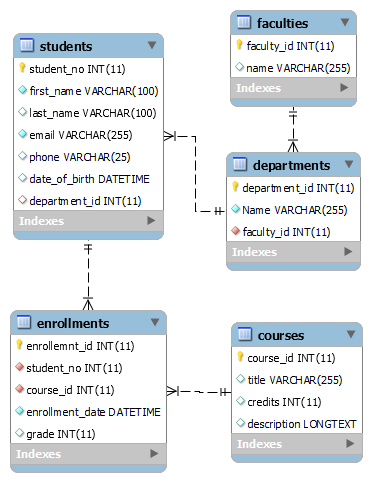

# University Information Management System

This folder contains the source code and database schema for a University Information Management System. The system is designed to manage information related to students, faculties, courses, enrollments, and departments.

## Entity-Relationship Diagram (ERD)

The Entity-Relationship Diagram (ERD) for the database schema is as follows:




## Table Initialization

The following code initializes the tables related to the University Information Management System:
```sql
File:init.sql
```
```sql
CREATE TABLE `faculties` (
  `faculty_id` int(11) NOT NULL,
  `name` varchar(255) DEFAULT NULL,
  PRIMARY KEY (`faculty_id`)
); 

CREATE TABLE `departments` (
  `department_id` int(11) NOT NULL,
  `Name` varchar(255) NOT NULL,
  `faculty_id` int(11) NOT NULL,
  PRIMARY KEY (`department_id`),
  KEY `faculty_id_fk_idx` (`faculty_id`),
  CONSTRAINT `faculty_id_fk` FOREIGN KEY (`faculty_id`) REFERENCES `faculties` (`faculty_id`) ON DELETE NO ACTION ON UPDATE NO ACTION
);

CREATE TABLE `students` (
  `student_no` int(11) NOT NULL,
  `first_name` varchar(100) NOT NULL,
  `last_name` varchar(100) DEFAULT NULL,
  `email` varchar(255) NOT NULL,
  `phone` varchar(25) DEFAULT NULL,
  `date_of_birth` datetime DEFAULT NULL,
  `department_id` int(11) DEFAULT NULL,
  PRIMARY KEY (`student_no`),
  KEY `department_id_fk_idx` (`department_id`),
  CONSTRAINT `department_id_fk` FOREIGN KEY (`department_id`) REFERENCES `departments` (`department_id`) ON DELETE NO ACTION ON UPDATE NO ACTION
);

CREATE TABLE `courses` (
  `course_id` int(11) NOT NULL,
  `title` varchar(255) DEFAULT NULL,
  `credits` int(11) DEFAULT NULL,
  `description` longtext,
  PRIMARY KEY (`course_id`)
);

CREATE TABLE `enrollments` (
  `enrollemnt_id` int(11) NOT NULL,
  `student_no` int(11) NOT NULL,
  `course_id` int(11) NOT NULL,
  `enrollment_date` datetime NOT NULL,
  `grade` int(11) DEFAULT NULL,
  PRIMARY KEY (`enrollemnt_id`),
  KEY `student_no_idx` (`student_no`),
  KEY `course_id_fk_idx` (`course_id`),
  CONSTRAINT `course_id_fk` FOREIGN KEY (`course_id`) REFERENCES `courses` (`course_id`) ON DELETE NO ACTION ON UPDATE NO ACTION,
  CONSTRAINT `student_no_fk` FOREIGN KEY (`student_no`) REFERENCES `students` (`student_no`) ON DELETE NO ACTION ON UPDATE NO ACTION
);
```

## Insert Fake Data
```sql
File:seed.sql
```
```sql
INSERT INTO faculties (faculty_id, name) VALUES
(1, 'Faculty of Engineering'),
(2, 'Faculty of Arts'),
(3, 'Faculty of Science');

INSERT INTO departments (department_id, Name, faculty_id) VALUES
(1, 'Computer Science', 1),
(2, 'Electrical Engineering', 1),
(3, 'English Literature', 2),
(4, 'Biology', 3);

INSERT INTO students (student_no, first_name, last_name, email, phone, date_of_birth, department_id) VALUES
(1001, 'John', 'Doe', 'john.doe@example.com', '123-456-7890', '2000-08-15', 1),
(1002, 'Jane', 'Smith', 'jane.smith@example.com', '987-654-3210', '2001-03-25', 3),
(1003, 'David', 'Brown', 'david.brown@example.com', '555-555-5555', '2001-11-10', 2),
(1004, 'Emily', 'Johnson', 'emily.johnson@example.com', '111-222-3333', '2001-09-03', 4);

INSERT INTO courses (course_id, title, credits, description) VALUES
(101, 'Introduction to Programming', 3, 'Basic programming concepts using Java'),
(102, 'Literary Analysis', 3, 'Study of various literary works and analysis techniques'),
(103, 'Circuit Theory', 4, 'Fundamental principles of electrical circuits'),
(104, 'Cell Biology', 4, 'Study of cell structure and function'),
(105, 'Data Structures and Algorithms', 4, 'Study of data structures and algorithms'),
(106, 'Shakespearean Literature', 3, 'Exploration of Shakespeare''s plays and sonnets'),
(107, 'Digital Electronics', 3, 'Introduction to digital electronics and logic circuits'),
(108, 'Genetics', 4, 'Study of genes and heredity');

INSERT INTO enrollments (enrollemnt_id, student_no, course_id, enrollment_date, grade) VALUES
(1, 1001, 101, '2024-03-25', 85),
(2, 1002, 102, '2024-03-25', 78),
(3, 1003, 103, '2024-03-25', NULL),
(4, 1004, 104, '2024-03-25', 91),
(5, 1001, 105, '2023-09-01', 79),
(6, 1002, 106, '2023-09-01', 87),
(7, 1003, 107, '2023-09-01', NULL),
(8, 1004, 108, '2023-09-01', 95),
(9, 1001, 107, '2023-09-01', 83),
(10, 1002, 105, '2023-09-01', 91),
(11, 1003, 108, '2023-09-01', NULL),
(12, 1004, 106, '2023-09-01', 88);
```

## Example Query

Here are some example queries you can use to interact with the University Information Management System:

##### Find the number of students enrolled in each course:
```sql
SELECT c.title AS course_title, COUNT(e.student_no) AS student_count
FROM courses c
JOIN enrollments e ON c.course_id = e.course_id
GROUP BY c.title;
```

##### Get selected course with its students
```sql
SELECT c.title AS course_title, s.first_name, s.last_name
FROM courses c
JOIN enrollments e ON c.course_id = e.course_id
JOIN students s ON e.student_no = s.student_no
WHERE c.title = 'Introduction to Programming';
```

##### Get all students with their department name and their courses
```sql
SELECT s.first_name, s.last_name, d.Name AS department_name, c.title AS course_title
FROM students s
JOIN departments d ON s.department_id = d.department_id
JOIN enrollments e ON s.student_no = e.student_no
JOIN courses c ON e.course_id = c.course_id;
```